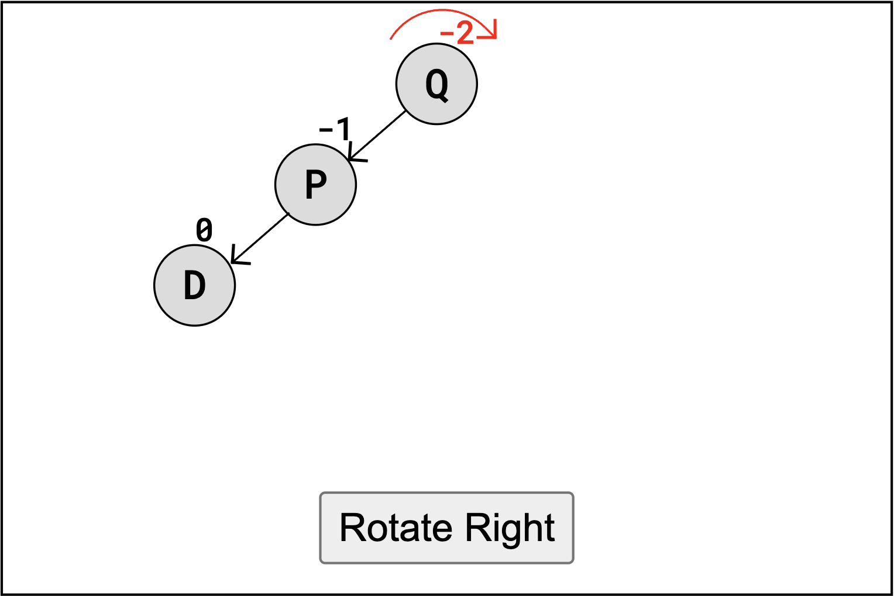
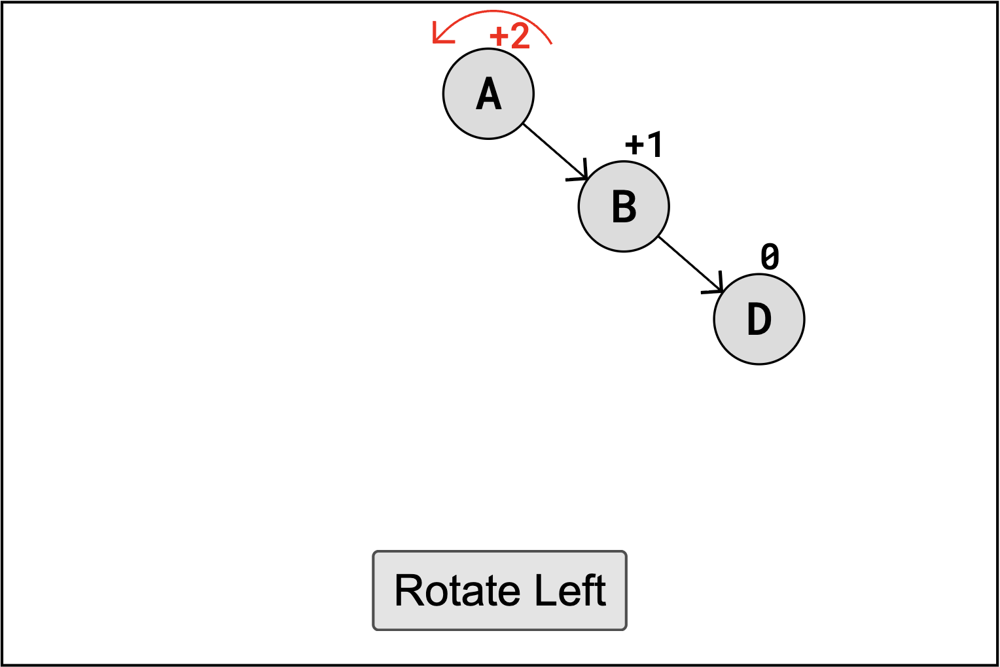
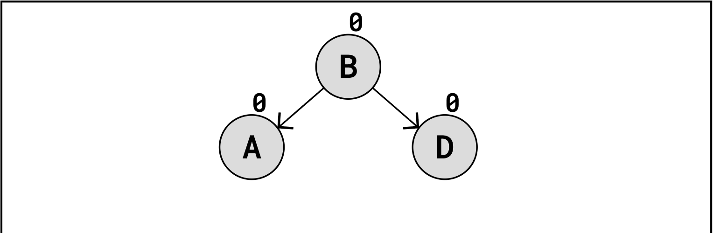
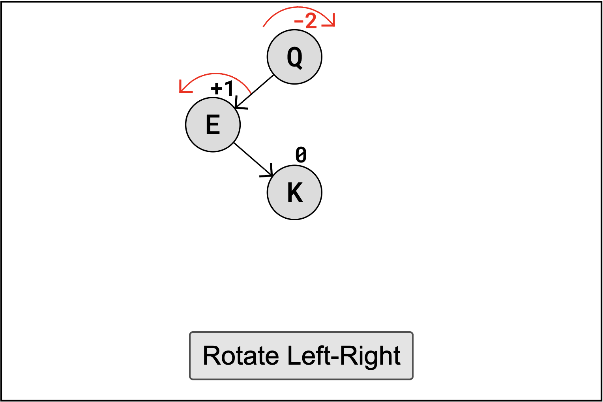
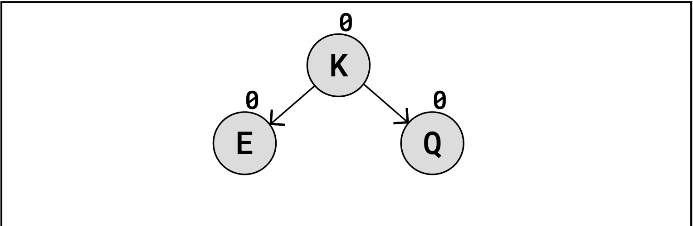
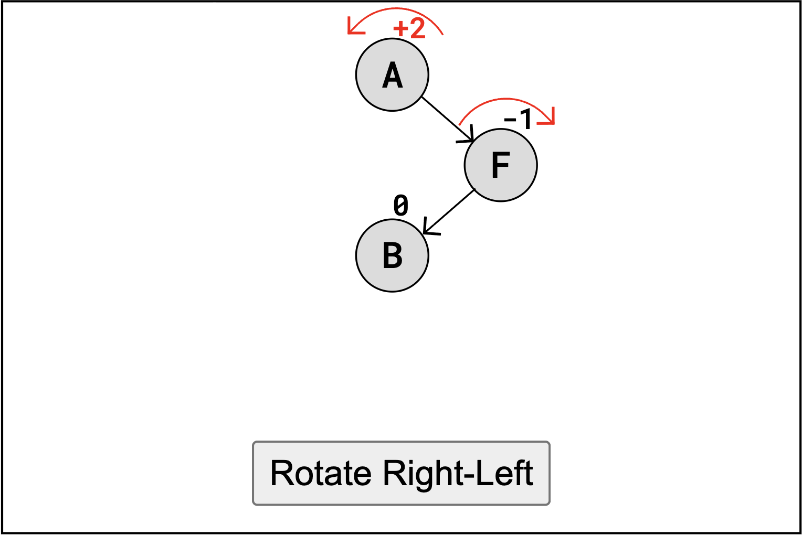
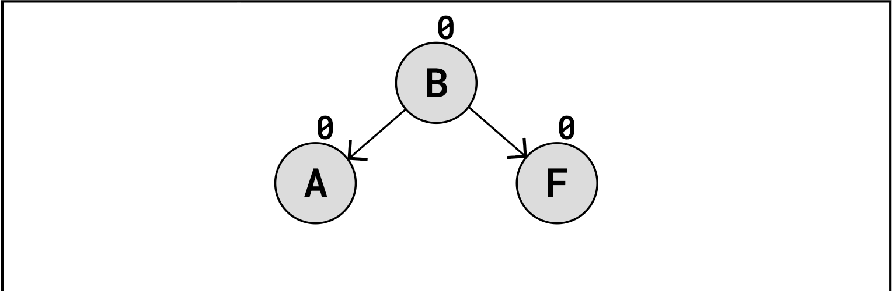

# AVL Trees

An AVL tree is a type of self-balancing Binary Search Tree invented in 1962 by two Soviet inventors Georgy Adelson-Velsky and Evgenii Landis, the namesakes of the data structure.

AVL trees are designed to keep tree height to a minimum in order to assure optimal time complexity of algorithms that depend on the height of the tree, such as searching, inserting, and deleting nodes. In order to do this, they use rotation operations to keep the tree balanced such that the left and right trees remain the same length or as close as possible. 

## Perfectly Balanced
In order to determine how to balance the tree, a balance factor is calculated for each node equal to the difference in height between the right subtree and the left subtree. For efficiency, this heights are stored at every node. If the absolute value of the balance factor reaches two or more, the tree is out of balance because one node could be moved between subtrees to reduce the balance factor.

For example, if there is one node in the right subtree and three in the left subtree, the balance factor would be -2: telling us that the tree is out of balance. This makes sense because, if we were to move a node from the left subtree to the right subtree, they both would have two nodes reducing the height of the tree. 

## As All Things Should Be
There are four distinct out-of-balance cases a node can be in on an AVL tree:

### Descriptions
| Case | Description | Solution |
|----------|----------|----------|
| LL       | The unbalanced node and its left child are both left heavy | A single right rotation |
| RR       | The unbalanced node and its right child are both right heavy | A single left rotation |
| LR       | The unbalanced node is left heavy, but its left child is right heavy | First do a left rotation on the left child node, then do a right rotation on the unbalanced node |
| RL       | The unbalanced node is right heavy, but its right child is left heavy | First do a right rotation on the right child node, then do a left rotation on the unbalanced node |

### Examples
Here are some example cases visualized with the balanced factors displayed.

| Case | Before | After |
|----------|----------|----------|
| LL       |  |  |
| RR       |  |  |
| LR       |  |  |
| RL       |  |  |

(Visualizations thanks to [W3 Schools](https://www.w3schools.com/dsa/dsa_data_avltrees.php)!)

## Operations on AVL Trees
Operations on AVl trees are almost the exact same as normal BSTs and other trees that utilize rotation operations, with the exception of the extra balancing step. After inserting or deleting a node on an AVL, it may become unbalanced. To find if the tree is unbalanced, the heights and balance factors of all ancestor nodes need to be updated through a retracing step that is typically handled with recursion. As the node is traced back to the root, each ancestor node's height is updated and its balance factor is recalculated. If any ancestor node is found to have a balance factor outside the range of -1 to 1, a rotation is performed at that node to restore the tree's balance.

## Time Complexity of AVL Operations

- Binary Search Trees are not self-balancing. This means that a BST can be very unbalanced, functioning almost like a linked list not a tree. This makes operations like searching, deleting and inserting nodes slow, with time complexity $O(h) = O(n)$.
- The AVL Tree however is self-balancing. That means that the height of the tree is kept to a minimum so that operations like searching, deleting and inserting nodes are much faster, with time complexity  
$O(h) = O(log(n))$.